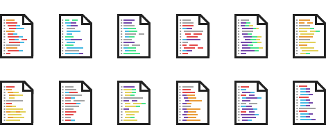

# Codicons
[Codicons](http://www.phildionne.com/codicons) is an icon set of programming languages.

### Three sizes
Large, medium and small.

### Twelve languages
Including Ruby, Python, Javascript, Perl, PHP, HTML, CSS, C++, C, Java, Shell and Objective-C.

### Pixel perfect
Yep.

---

# Author
[Philippe Dionne](http://www.phildionne.com)

# Copyright and license

Copyright 2012 Philippe Dionne

Licensed under [CC BY 3.0](http://creativecommons.org/licenses/by/3.0/)
